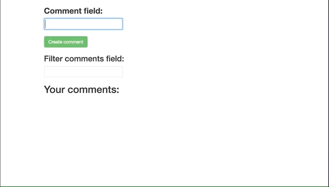

# JavaScript Code Challenge

## Objectives

- DOM Manipulation
- Events and Event Handlers
- Callbacks
- Constructors and Prototypes or ES6 Classes (For part two)

## Instructions

We're building out a commenting feature in our application (no backend persistence). A user should be able to create a new comment and add that comment to a 'comments list.' The comments list can be filtered via keyword.

## Deliverables

### Functionality demo

### Part One - Create a solution without utilizing Object Orientation(no classes) ****NO jQuery****.

1. **Create a working solution in `vanillaJS.js`**
  **DO NOT SKIP PART ONE LEAVE THE SOLUTION FOR PART ONE IN ITS OWN FILE**

  - The input field for comments/filter has been provided to you.

2. When a users clicks the 'Create comment' button, comments should be added to a comment list. The new comment should appear as an `<li>new comment text here</li>` element wrapped in an unordered list.

  - Each comment should have a delete button/link.

3. If a user provides a search term into the 'Filter comments' input field, the comments list should automatically display only comments containing the filtering term. (Hint: You could use a "keyup" event bound to the comments filtering input field).

  - If the user clears the filtering input all comments should be displayed again.

### Part Two - Refactoring with Constructors and Prototypes (feel free to use either ES5 or ES6)

**Note** When creating constructors and prototypes, you may use ES6 classes or just create the constructor function separately. Your choice.

1. **Create your refactored OO Solution in a new file.(`index.js`)**
2. Code your solution in `comment.js` and `commentList.js`
3. The commment class should support the following api: `new Comment('Comment text')`
4. Instances of comments should have a method called 'render' that returns a string representing an `li` HTML element containing the comment's text.
5. The comment lists class `commentList.js` should have a comments array. The initializer should be able to take an array of strings and convert them to comments
6. Instances of CommentList should have a method called 'render' that returns a string of a `ul`. Inside of the ul, the comment list should include the return value of the render method of all of it's comments.
7. Instances of CommentList should have a method called 'addComment' that takes in a string. It should instantiate a new Comment and add it to the CommentList's array of comments.
8. Implement a filter functionality for your comment list.
9. Implement a delete functionality on each comment.
