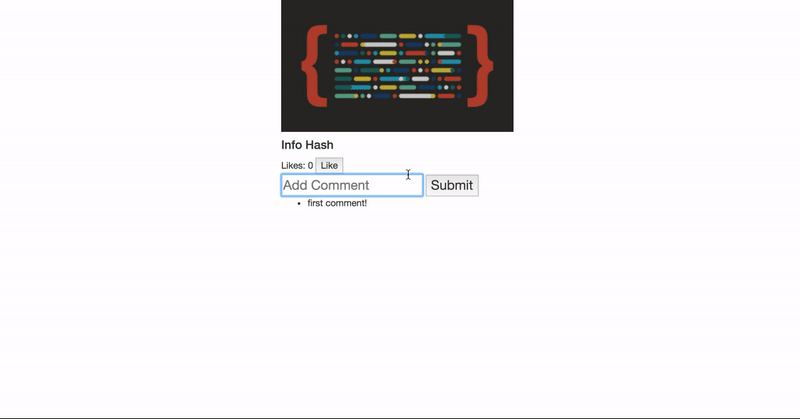

# JavaScript Code Challenge

## Objectives

- DOM Manipulation
- Events and Event Handlers
- Callbacks
- Fetching from APIs

## Instructions

Today we're building an app for viewing, liking, and commenting on a single picture. There is a backend API deployed on a server that you will use. You will be building out the frontend for this app.

A user of your app must be able to do the following things:

- As a user, when the page loads, I should see:
  - an image
  - any comments that image has
  - the number of likes that image has

- As a user, I can click a button to like an image. When I click, the number of likes the image has should increase by one without the page refreshing.

- As a user, I can enter text in an input field, and submit the form that the input is in. When I do, the app should add comment to the image without the page refreshing. I should see my new comment *below* any previous comments.

- As a user, when I refresh the page, any comments or likes I have added should still be there. When a user adds a like or a comment, make sure their changes are sent to the backend API.

## Functionality demo



## Deliverables and How to Approach

For this challenge it is important to work iteratively: one feature at a time, before moving on to the next. You should **prioritize making code that works over attempting all of the deliverables.** It is better to have a handfull of fully working features than 10 things that were attempted but do not work.

We have provided a series of prioritized steps to help you break down your approach this problem:

## Step 1 - Get the Image Data

When the page loads, you will need to make a request to the API to get the data about your picture. The API follows RESTful conventions, but *make sure you read the API documentation* to familiarize yourself with the models, their associations, and the available endpoints of the API.

#### API Docs

#### Endpoint to show an individual Image

Visit https://randopic.herokuapp.com/ in your web browser. The backend will assign you your very own `image_id`.  **THIS IS YOUR ASSIGNED IMAGE. This prevents your classmates from editing your images and vice versa**.

**Before you start anything else, locate the variable `imageId` in the `src/index.js`. Replace the value of the variable with your image id, and use it as the `/:id` parameter in your initial GET request.** This will be the image you'll be working with for this code challenge.

```js
GET 'https://randopic.herokuapp.com/images/:id'
```

```json
Example Response:
{
  "id": 1,
  "url": "http://blog.flatironschool.com/wp-content/uploads/2016/07/072716-js-saved-web-4-352x200.jpg",
  "name": "The Internet!",
  "like_count": 0,
  "comments": [
    {
      "id": 5941,
      "content": "first comment!",
      "image_id": 1158,
      "created_at": "2018-10-18T17:06:14.859Z",
      "updated_at": "2018-10-18T17:06:14.859Z"
    }
  ]
}
```

Use the data from the API response to change what's currently on the page (take a look at the already provided `index.html`). You will need to add/update:

- the image url
- the image name
- the number of likes
- any comments in an unordered list

(If you cannot get your fetch request to work correctly, you can  use the example response above to append content to the DOM and attempt the subsequent steps)

## Step 2 - Like Feature (Frontend)

The next feature to approach is the functionality to add likes to a picture. First, get this working in the browser only without worrying about persistence.

Clicking the 'Like' button should increase the number of likes shown on the page by one.

A user can like the same picture multiple times.

---

## Step 3 - Like Feature (Backend)

This app will use what is called _optimistic rendering_. This means the DOM will be updated *before* the changes are added to the database. When a user clicks the 'Like' button we will immediately update the DOM. Next, your job is to make a POST request to persist the new Like in the backend database.

#### API Docs

#### Endpoint to create a Like

Send a string containing a JSON object as the request's body. In the JSON, make sure the `image_id` key has the value of your assigned image ID. This will tell your newly-created like which image it belongs to (remember database associations?😱).

```js
POST 'https://randopic.herokuapp.com/likes'

Required keys in the body of the request:
{
  image_id: (insert image id here)
}

Required Headers
{
  'Accept': 'application/json',
  'Content-Type': 'application/json'
}
```

```json
Example Response:
{
    "id": 112,
    "image_id": 8,
    "created_at": "2017-11-17T13:52:22.167Z",
    "updated_at": "2017-11-17T13:52:22.167Z"
}
```

Since we are using optimistic rendering, you shouldn't have to do anything with the response.

To test your code, make sure the number of likes increments when you click the like button. Then, refresh the page and make sure the increased number of likes remains the same.

---

## Step 4 - Comment Feature (Frontend)

The next feature to approach is the functionality to add comments to a picture. First, get this working in the browser only, without worrying about persistence.

Filling out the input and clicking 'Submit' should append your new comment as an `<li>` to the comments unordered list element. You should also clear out the text in the comment input, so it's empty and ready for the next comment to be added.

## Step 5 - Comment Feature (Backend)

As before, we need to persist the comment to the database, after optimistically rendering a comment.

#### API Docs

#### Endpoint to create a Comment

Similarly to before, this POST request's body should include the your assigned `imageId`. Remember associations? A `comment` `belongs_to` an `image`, so we need to send the `image_id` that the comment should be associated with:

```js
POST 'https://randopic.herokuapp.com/comments'

Required keys in the body of the request:
{
  image_id: (insert image id here),
  content: (insert comment content here)
}

Required Headers
{
  'Accept': 'application/json',
  'Content-Type': 'application/json'
}
```


```json
Example Response (created comment):
{
  "id": 5,
  "content": "nice",
  "image_id": 1,
  "created_at": "2018-10-18T19:10:40.369Z",
  "updated_at": "2018-10-18T19:10:40.369Z"
}
```

Since we are using optimistic rendering, you shouldn't have to do anything with the response.

To test your code you should be able to refresh the page and see any comments you added.

## BONUS - NOT REQUIRED

## Step 6 - Delete a comment feature

This feature is not required, and you should only attempt if you have time.

When you display new comments, add a button next to each comment. Clicking the button should delete the comment from the DOM, *as well as deleting it from the database*.

Take the same iterative approach as before. Use pessimistic rendering.

#### API Docs

#### Endpoint to delete a Comment

```
DELETE 'https://randopic.herokuapp.com/comments/:comment_id'

Example Response:
{
  message: 'Comment Successfully Destroyed'
}
```

_(Hint: To get the comment's id you may have to think about changing the way you handle the response received from creating a comment)_
